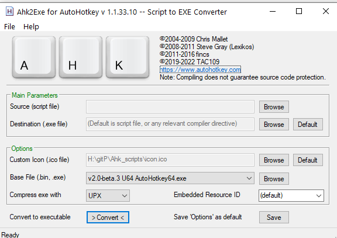

# AutoHotkey V2

## Install

https://www.autohotkey.com/v2/

## Editor

**SciTE4AutoHotkey**

https://fincs.ahk4.net/scite4ahk/

### Enable V2 syntax 

https://www.autohotkey.com/scite4ahk/pages/ahkv2.htm

set V2 exe file as %AutoHotkeyDir%\v2-alpha\x64\AutoHotkey.exe

## Compress exe

Set the exe in folder %AutoHotkeyDir%\compiler

### UPX (In first test compress better)

https://github.com/upx/upx/releases/tag/v3.96

### MPRESS

https://www.autohotkey.com/mpress/mpress_web.htm

## Convert AHK to EXE

